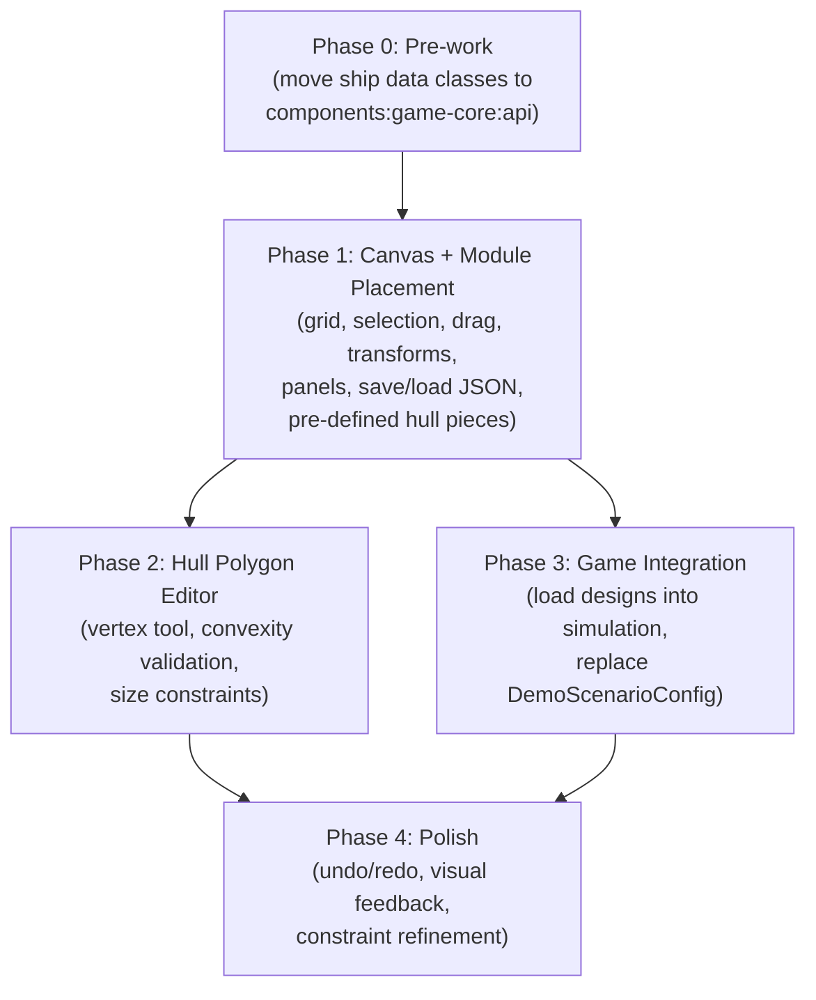

# Ship Builder

## Problem Frame

Ship designs are currently hardcoded in `DemoScenarioConfig.kt` as Kotlin constants. This makes iterating on ship designs slow (requires recompilation), prevents exploring multi-hull ship configurations, and blocks future expansion of the ship model. A visual ship builder will enable rapid design iteration, unblock multi-hull ships, and establish the serialization format needed for the game simulation to load player-designed ships.

The builder is primarily a developer-facing design tool at this stage, not a polished player feature. Keeping engagement and creative exploration high is an explicit goal.

## Terminology

- **Hull polygon**: A convex polygon defining a collision/armour boundary. The atomic geometric unit.
- **Hull piece**: A reusable hull polygon template stored in the parts library (may have associated armour stats and size category).
- **Hull piece instance**: A placed copy of a hull piece on the design canvas, with position and rotation.
- **Module**: An internal system (Reactor, Engine, Bridge) or turret placed within a hull piece instance.

## Phased Delivery

The feature is structured as a sequence of additive slices. Each phase produces a usable tool; later phases layer on new capability. Phase 3 can be delivered after Phase 1 — the hull polygon editor (Phase 2) is an independent enhancement.

## Requirements

### Pre-work (Phase 0)

- R33. Ship data classes (`ShipConfig`, `HullDefinition`, `ArmourStats`, `MovementConfig`, `CombatStats`, `InternalSystemSpec`, `TurretConfig`, `GunData`, `ProjectileStats`) must be moved from `features/game/impl` to `components/game-core/api` so both the game and builder feature modules can access them without violating module boundary rules.

### Canvas and Grid

- R1. The design canvas occupies the main screen area (right of the parts panel). It displays a square grid background that illustrates snap positions.
- R2. Items placed on the canvas snap to grid intersections. The appropriate grid cell size is to be determined during planning — it may be configurable or derived from ship size category.
- R3. The canvas supports pan (drag) and zoom (pinch/scroll), consistent with the game viewport controls.

### Parts Panel (Left)

- R4. A scrollable column on the left side lists available parts: internal modules, turret modules, and hull pieces, grouped into collapsible categories.
- R5. Each list item shows a preview rendering and its name or ID.
- R6. Clicking a part in the panel adds an instance of it to the canvas, centered on the grid origin.
- R34. In Phase 1, a set of pre-defined hull pieces (derived from the existing hull definitions in `DemoScenarioConfig`) is available in the parts panel. Custom hull pieces are added via the polygon editor in Phase 2.

### Selection and Manipulation

- R7. Clicking an item on the canvas selects it, indicated by a bright outline drawn around the item's collision bounds.
- R8. A selected item can be dragged to a new position, snapping to the grid.
- R9. When an item is selected, a transform toolbar appears at the bottom of the screen offering: mirror X, mirror Y, rotate 90 degrees clockwise, rotate 90 degrees anti-clockwise.
- R10. A free-rotate handle appears near the selected item, offset in its forward-axis direction, allowing continuous rotation by dragging.

### Placement Rules

- R11. Internal modules and turrets must be placed within the bounds of a hull piece instance. Placement outside hull bounds is rejected or snapped to the nearest valid position.
- R12. Hull piece instances may overlap each other freely.
- R13. Turrets are placed like any other module (freely within hull bounds), not edge-mounted.

### Hull Polygon Editor (Phase 2)

- R14. A polygon creation tool allows drawing new convex hull polygons directly on the canvas. A floating action button (and right-click) starts/ends the tool.
- R15. While the tool is active, each click places a vertex. A line is drawn along the polygon outline from vertex to vertex, closing from the last vertex back to the first.
- R16. Vertices snap to the grid when placed.
- R17. New vertices are inserted into the polygon vertex list immediately after the currently selected vertex. The new vertex becomes the selected vertex. This applies during both initial creation and later editing.
- R18. If a placed vertex snaps to the position of an existing vertex, R18 takes priority over R17: the existing vertex becomes selected (with distinct visual treatment) instead of creating a duplicate. That vertex can then be dragged to a new position. Subsequent vertex placements resume inserting after this newly selected vertex per R17.
- R19. After each vertex change, a convexity check is performed. A concave (invalid) polygon is rendered in red.
- R20. Hull polygons have a vertex count limit and may have maximum dimension constraints, potentially linked to size categories chosen when invoking the tool.
- R21. When polygon creation is finished, the shape is saved as a new hull piece in the design's hull piece library and becomes available from the parts panel. The drawn polygon becomes an instance of that hull piece on the canvas.

### Ship Stats Panel (Right)

- R22. A minimisable column on the right displays procedural ship stats calculated from the current design: total mass, acceleration rates in each cardinal direction, and rotation acceleration.
- R23. Mass is calculated from hull piece instance masses (based on size category rather than polygon area), armour, and internal system masses.
- R25. The stats panel includes a section with editable attributes, such as the design name.
- R26. The stats panel includes a button to load other existing ship designs, ensuring the current design is saved first before loading the selected file.

### Save/Load and Serialization

- R27. Ship designs are serialized as JSON using kotlinx.serialization and persisted to the file system via platform-specific file I/O (`expect`/`actual`). Kubriko PersistenceManager is not suitable — it is backed by `java.util.prefs.Preferences` (8KB value limit, no key enumeration).
- R28. A new temporary ship design file is created when launching the builder. The design auto-saves to disk after every change on the canvas or to ship data. Work-in-progress designs that are not yet simulation-valid are permitted in the save format.
- R30. The JSON format must capture everything currently needed to instantiate a ship in the game simulation: hull definitions (vertices, armour), internal systems, turret configs (position, gun data), movement config, combat stats, and a drawable resource identifier. Kubriko types (`SceneOffset`, `AngleRadians`) require custom serializers. `DrawableResource` is stored as a string identifier mapped to resources at load time.

### Undo/Redo (Phase 4)

- R29. The builder maintains a session-level undo/redo history, allowing changes to be reversed even though they are auto-saved. This layers on top of the auto-save system from Phase 1.

### Game Integration (Phase 3)

- R31. Ship designs saved by the builder can be loaded into the game simulation, replacing the role of `DemoScenarioConfig` hardcoded ship definitions.
- R32. Everything currently used to create ships in `GameStateManager.createShip()` must be suppliable from a ship design file. No simulation data should exist only in code constants.

## Success Criteria

- A developer can visually place modules and hull pieces on a grid canvas, see live stats update, and save the result as JSON.
- A saved ship design can be loaded back into the builder for further editing.
- (Phase 3) A saved ship design can be loaded into the game simulation and plays identically to the current hardcoded ships.
- The builder runs on both Desktop and Android.

## Scope Boundaries

- Not a polished player-facing feature — functional developer tool aesthetic is fine.
- No heat management, damage control, or systems beyond what the current combat slice supports.
- No multiplayer or sharing of designs.
- No procedural ship generation.
- No sprite/visual customisation — ships continue to use existing sprite assets; the builder works with collision geometry and module layout.
- Grid type starts as square; hex or other grids are a future option, not this scope.
- Max angular velocity scaling with ship size is a desirable future simulation mechanic but is not part of this feature. The stats panel can add it once the simulation supports it.

## Key Decisions

- **Module placement is hull-constrained from the start**: Modules must be placed within hull piece bounds, even in Phase 1. Pre-defined hull pieces are available to make this workable before the polygon editor exists.
- **Hull overlap allowed**: Multi-hull ships can have overlapping hull piece instances. Simpler placement rules; overlap handling deferred to simulation concerns.
- **Turrets are freely placeable within hulls**: Not edge-mounted. Same placement rules as other modules.
- **Auto-save in Phase 1, undo/redo in Phase 4**: Auto-save is sufficient for a developer tool initially. Undo/redo layers on later without reworking the save system.
- **File-based JSON storage**: Platform file I/O via `expect`/`actual`, not Kubriko PersistenceManager (8KB limit, no key listing).
- **Square grid, flexible for future swap**: Grid is a rendering/snapping concern, not baked into the data model.
- **Size-category-based hull mass**: Hull piece mass derived from size category rather than polygon area, keeping the calculation simple and designer-friendly.
- **Pre-work module refactor**: Ship data classes move to `components:game-core:api` before builder work begins.
- **Hull pieces stored inline in design files**: Each ship design file contains its own hull piece definitions. No separate shared hull library — keeps persistence simple.

## Dependencies / Assumptions

- kotlinx.serialization can handle all ship data types with custom serializers for Kubriko value classes (`SceneOffset`, `AngleRadians`).
- `DrawableResource` references are stored as string identifiers with a lookup registry that maps them back to Compose resource references at load time.
- The existing ship data class hierarchy can be extended with `@Serializable` annotations or mapped to serializable DTOs without breaking the game simulation.
- Platform file I/O is implementable via `expect`/`actual` for both Android (internal storage) and Desktop (app data directory).

## Outstanding Questions

### Deferred to Planning

- [Affects R2][Technical] What grid cell size works well for ship design? Should it be configurable or derived from a size-category selection?
- [Affects R1, R3][Technical] Should the builder canvas use a Compose Canvas with custom drawing, or a Kubriko viewport instance? Compose Canvas gives full editor control; Kubriko provides built-in pan/zoom but is optimised for game simulation, not editor interactions. Significant architectural choice.
- [Affects R11][Technical] How to efficiently test point-in-polygon for module placement validation — use Kubriko's existing collision masks or a standalone geometry utility?
- [Affects R20][Technical] What are appropriate vertex limits and dimension constraints per size category? Needs experimentation.
- [Affects R30][Technical] Where should the `DrawableResource` string-to-resource lookup registry live? Must be accessible to both builder and game modules.
- [Affects R29][Technical] What undo/redo implementation pattern fits best — command pattern, state snapshots, or diff-based? Consider interaction with auto-save.
- [Affects R27][Technical] File storage location and naming convention for ship design JSON files on each platform.

## Next Steps

-> `/ce:plan` for structured implementation planning (recommend planning Phase 0 + Phase 1 as the first deliverable)
